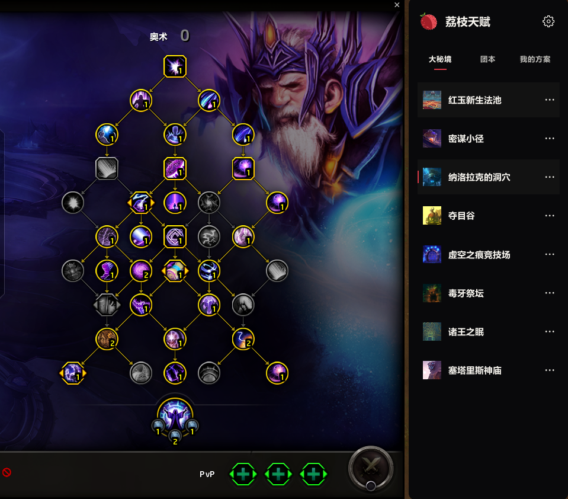

# Lychee Talent

**Find your build for the encounter. Keep your focus on the fight.**

Open talents. Pick the encounter. Double-click to apply.

[简体中文](README.md) · [English](README.en.md)

Browse builds drawn from high-performing WCL records beside the native talent window. Keep your own builds in the same place, give them icons and link them to encounters.

## Before your next pull

| What you need | What to do |
| :--- | :--- |
| A dungeon build | Open Mythic+, find the dungeon and double-click |
| A boss build | Open Raids and select Heroic or Mythic |
| The original record | Use the row's `…` menu to view the WCL source |
| A friend's build | Import the string under My Builds |
| Your current setup | Choose Save Current under My Builds |
| Different action bars | Enable Independent Action Bars in the build's menu; applied on the next switch |

Importing or saving adds a build without applying it. All builds share one native “Lychee Talent” loadout per specialization. Independent action bars store each build's layout; otherwise the addon restores the specialization's initial default layout. Key bindings stay unchanged.

Encounter reminders offer matching recommendations or linked personal builds. **Talents change only when you click Switch.** Reminders hide in combat and skip matching builds. Turn them off using the settings gear.

## Installation

1. Download the [source ZIP](https://github.com/Follen/LycheeTalent/archive/refs/heads/main.zip), or an available package from [Releases](https://github.com/Follen/LycheeTalent/releases).
2. For source downloads, copy `LycheeTalent` and every `LycheeTalent_Data_*` folder from `addon` into `_retail_/Interface/AddOns/`. Release packages contain these folders directly.
3. Enable the addon and data packages, then open the native talent window or type `/lt`.

Requires Retail 12.1 (interface 120100). No Lychee Launcher or WCL credentials are needed. Class data loads on demand. Chinese and English interfaces are included.

## Recommendations

The snapshot was collected on **2026-09-26**: 1,815 builds across 13 classes, 40 specializations, eight Mythic+ scenarios and raid encounters, separating Heroic and Mythic.

The default Mythic+ reference is the highest key with usable talent data within the collected sample. Equal keys favor timed and faster runs. Collection used a 14-day window and up to two ranking pages by default; it is not a complete scan of every log. Data ships with addon updates. Gear, group and strategy still matter.

[Screenshots](docs/media/README.md) · [Performance](PERFORMANCE.md) · [Changes](Changelog.md) · [Development](docs/development.md) · [Feedback](https://github.com/Follen/LycheeTalent/issues)

Licensed under the **Lychee Non-Commercial Attribution License 1.0**, with Talent-specific project attribution. See [LICENSE](LICENSE) and [third-party notices](THIRD_PARTY_NOTICES.md).
