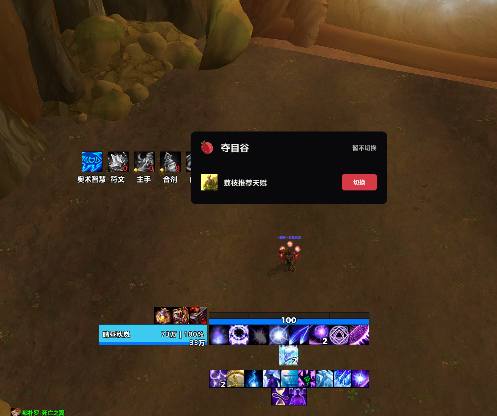
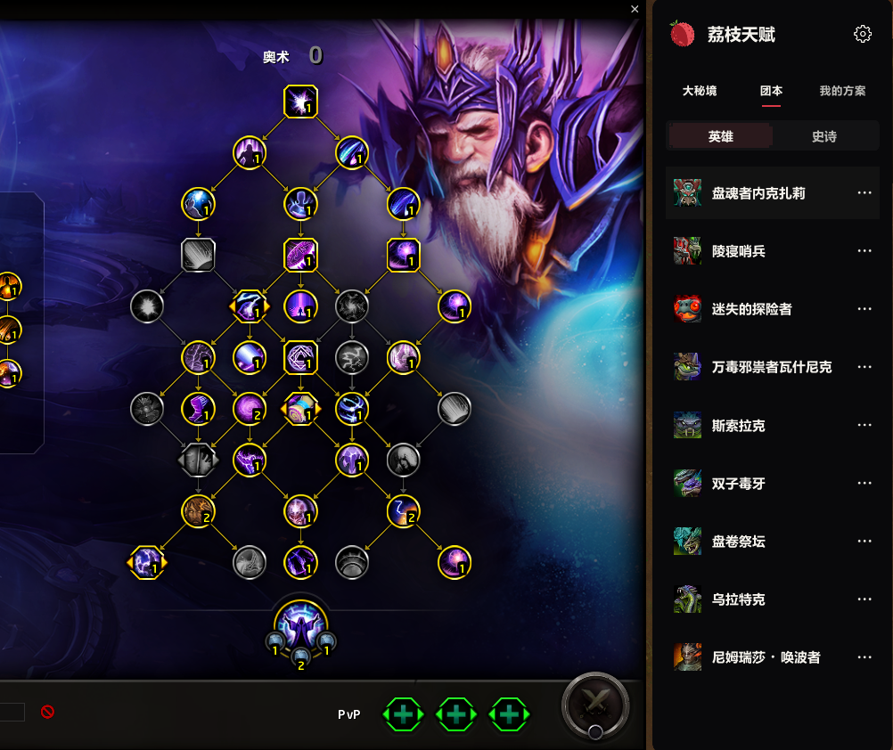
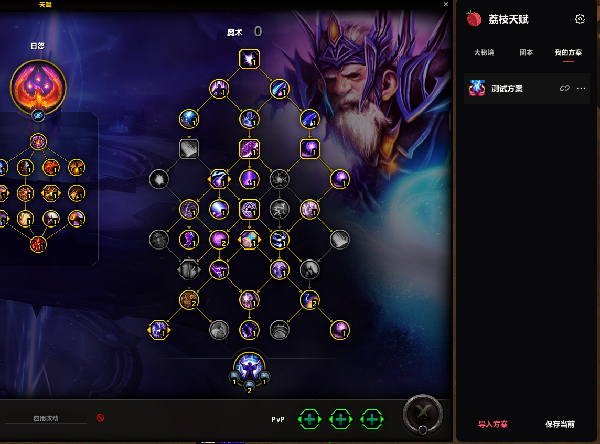

# 荔枝天赋

**找到这一战的天赋，把精力留给战斗。**

打开天赋页，选副本，双击应用。

[简体中文](README.md) · [English](README.en.md)

[安装](#install) · [怎么用](#use) · [游戏截图](docs/media/README.md) · [更新记录](Changelog.md) · [性能](PERFORMANCE.md)

原生天赋页旁边，就是这一场需要的方案。

换副本时，不必再翻网页找字符串，也不用在一长串方案里辨认名字。荔枝天赋参考 **WCL 高表现记录**，按副本和首领整理推荐；你自己的方案，也能一起保存、关联和切换。

## 打什么本，就选什么天赋

| 想做什么 | 在哪里操作 |
| :--- | :--- |
| 选一套大米天赋 | 打开「大秘境」，找到副本，双击方案 |
| 为下一个首领做准备 | 打开「团本」，选英雄／史诗难度，再找首领 |
| 看推荐从哪里来 | 悬停看记录信息；点行末 `…` 查看 WCL 来源 |
| 收下朋友分享的天赋 | 「我的方案」→「导入方案」，粘贴字符串 |
| 留住当前这套天赋 | 「我的方案」→「保存当前」 |
| 改名、换图标或关联副本 | 在个人方案的 `…` 菜单中选择编辑 |
| 分享给队友 | 在 `…` 菜单中复制字符串，然后按 Ctrl+C |

导入和保存只加入你的方案库，**双击应用才会切换天赋**。每个专精共用一个名为「荔枝天赋」的原生方案，不会为每个副本新增一栏。

### 动作条，也跟着方案走

某套天赋需要不同的技能摆放？在这套方案的 `…` 菜单中勾选「独立动作条」，下次应用时使用它自己的布局。取消后，下次应用恢复该专精首次启用时记录的默认布局。它管理动作条内容，不修改按键绑定。

### 到地方了，提醒你换

进入副本，或在可识别的团本首领附近停下时，荔枝会显示对应推荐。个人方案也可以关联多个副本或首领。**点击「切换」才应用**；战斗中收起提醒，当前已使用对应方案时不再提示。

不需要提醒时，点右上角齿轮关闭「天赋切换提醒」。它同时控制内置推荐和个人方案。

<table>
<tr>
<td width="50%"></td>
<td width="50%"></td>
</tr>
<tr><td align="center">下一个首领，用对应天赋</td><td align="center">自己的方案，也随时在手边</td></tr>
</table>

[查看全部实机截图](docs/media/README.md)

## 安装，打开就能用

1. 下载[源码 ZIP](https://github.com/Follen/LycheeTalent/archive/refs/heads/main.zip)，或在[发布页](https://github.com/Follen/LycheeTalent/releases)选择可用的安装包。
2. 源码 ZIP：把 `addon` 内的 **`LycheeTalent` 和全部 `LycheeTalent_Data_*` 文件夹**复制到正式服 `_retail_/Interface/AddOns/`。安装包则直接解压这些文件夹。
3. 进入游戏，在插件列表启用荔枝天赋及职业数据包，打开原生天赋页。也可以输入 **`/lt`** 或 **`/lycheetalent`**。

正确目录是 `Interface/AddOns/LycheeTalent/LycheeTalent.toc`，不要多套一层仓库文件夹。第一次安装后若游戏没有发现插件，回到角色选择界面检查插件列表。

这是独立插件，无需安装荔枝启动器、WCL 客户端或配置 API 密钥。13 个职业数据包按需加载，完整安装不会在登录时读入全职业数据。

## 推荐从哪里来

当前随包数据采集于 **2026-09-26**：13 职业、40 专精、8 个大秘境场景及团本首领，合计 **1,815 条推荐组合**。团本区分英雄和史诗，缺少有效记录的组合不会补造数据。

大秘境默认参考有可用天赋的最高层记录，同层优先限时与更短用时。本批采集使用最近 14 天观察窗口、默认最多两页排名，因此并不代表全部日志。推荐是实战参考，适合你的选择仍与装备、队伍和打法有关。

数据随插件版本更新，游戏内不联网采集。更新赛季后应使用对应数据版本。

## 常见问题

**支持哪些客户端？** 当前面向正式服 12.1（TOC 120100）；不是怀旧服插件。界面提供中文和英文。

**会覆盖我已有的原生方案吗？** 插件复用自己的原生方案。原生栏位不足时会停止，需你在原生界面腾出栏位；不会自动删除其他方案。

**为什么有时不提醒？** 当前天赋已匹配、正在战斗、关闭提醒或没有可靠的场景信息时不会提示。普通／随机团本不会套用英雄推荐；地图位置受限时不会猜测首领。

**性能怎么样？** 职业数据按需加载，列表与图标控件复用。已测结果和待覆盖场景见 [PERFORMANCE.md](PERFORMANCE.md)。

**如何反馈？** 到 [Issues](https://github.com/Follen/LycheeTalent/issues) 留下客户端版本、专精、操作步骤与错误信息。截图前请遮去个人聊天信息。

## 协议与项目资料

使用与荔枝相同的 **Lychee 非商业署名许可证 1.0**，项目名称及来源指向荔枝天赋；完整条款见 [LICENSE](LICENSE)，第三方与游戏素材见 [THIRD_PARTY_NOTICES.md](THIRD_PARTY_NOTICES.md)。

[开发说明](docs/development.md) · [天赋与动作条机制](docs/talent-application.md) · [平台介绍与素材](docs/publishing/README.md)
